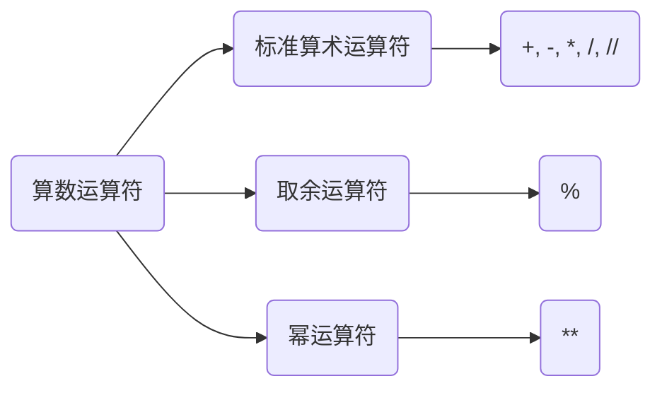
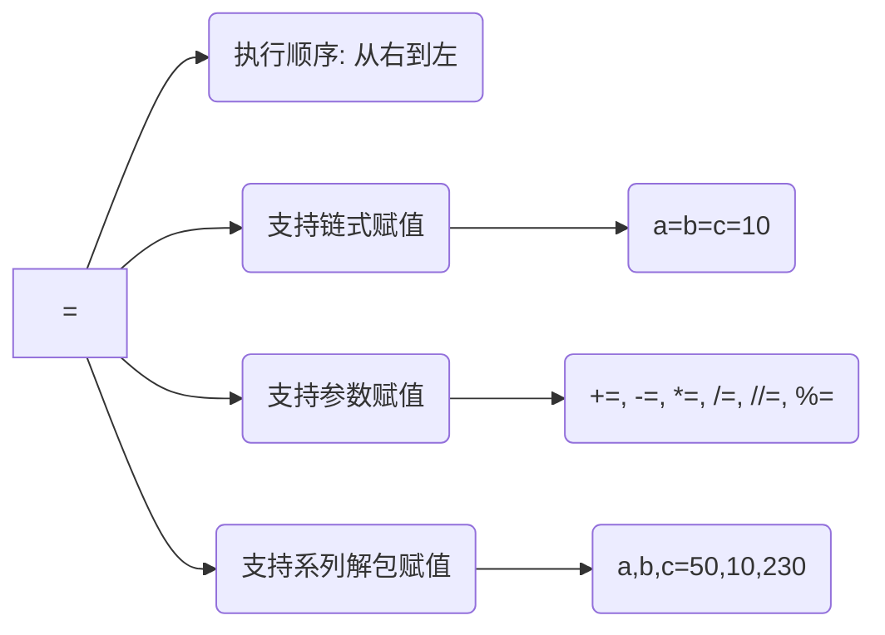
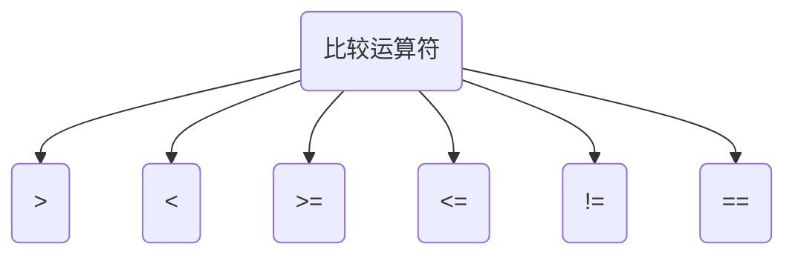

## 运算符

<hr/>

### 一：算术运算符



1. 标准算数运算符

   + 加(+)，减( - )，乘( * )，除( / )，整除( // )
   + 整除运算会省略余数

2. 取余运算符

   + 取两数相除时的余数

3. 幂运算符

   + (2**3)：表示2的三次方

4. 拓展

   1. 做整除运算时，遇到一正一负的整除运算，向下取整

   2. 做取余运算时，遇到一正一负的情况，遵循公式：<font color="orange">余数 = 被除数 - 除数 * 商</font>

      *商是进行整数运算得到的。*


### 二：赋值运算符




1. 解析

   1. 等号( = ):  等号是Python中最基本的赋值运算符，用于将右侧的值赋给左侧的变量。
   2. 加等于( += ):  加等于运算符用于将右侧的值加到左侧的变量，并将结果赋给该变量。
   3. 减等于( -= ):  减等于运算符用于将右侧的值从左侧的变量中减去，并将结果赋给该变量。
   4. 乘等于( *= ):  乘等于运算符用于将左侧的变量与右侧的值相乘，并将结果赋给该变量。
   5. 除等于( /= ):  除等于运算符用于将左侧的变量除以右侧的值，并将结果赋给该变量。
   6. 取模等于( %= ):  取模等于运算符用于将左侧的变量对右侧的值取模，并将结果赋给该变量。
   7. 幂等于( **= ):  幂等于运算符用于将左侧的变量的值求幂，幂值为右侧的值，并将结果赋给该变量。
   8. 取整除等于( //= ):  取整除等于运算符用于将左侧的变量对右侧的值进行整数除法，并将结果赋给该变量。

2. **演示：**

   ```python
   a = b = c = d = e = f = g = 10
   a += 5
   b -= 5
   c *= 5
   d /= 5
   e //= 5
   f %= 5
   g **= 5
   print(a,b,c,d,e,f,g)
   ```

   **输出：**

   ```python
   15 5 50 2.0 2 0 100000
   ```


### 三：比较运算符



**演示：**

```python
print(3 == 4)
print(3 != 4)
print(3 > 4)
print(3 < 4)
print(4 >= 4)
print(5 <= 4)
```

**输出：**

```python
False
True
False
True
True
False
```


### 四：逻辑运算符

- 与（and）：如果两个条件都为真，则结果为真。

- 或（or）：如果两个条件中至少有一个为真，则结果为真。

- 非（not）：用于取反条件的结果，如果条件为假，则结果为真，反之亦然。

- **演示：**

  ```python
  print(True and False)
  print(True or False)
  print(True and not False)
  ```
  
  **输出：**
  
  ```python
  False
  True
  True
  ```
  
  

### 五：三元运算符

+ <b><u>true-value<sup><mark>1</mark></sup></u>  if  <u>condition<sup><mark>2</mark></sup></u>  else  <u>false-value<sup><mark>3</mark></sup></u></b>

  <sup><mark>1</mark></sup>：表达式为 True 返回的值

  <sup><mark>2</mark></sup>：条件表达式

  <sup><mark>3</mark></sup>：表达式为 False 返回的值

+ **演示：**

  ```python
  k = 10
  l = 9
  v = k if k>l else l
  print(v)
  ```

  **输出：**

  ```python
  9
  ```


### 六：拓展

1. 运算符优先级
   1. 括号
   2. 幂运算符（**）
   3. 一元加号（+）和一元减号（-）
   4. 乘法（*）、除法（/）、取模（%）和取整除（//）
   5. 加法（+）和减法（-）
2. 布尔值为 False
   1. False
   2. 0
   3. None
   4. ""
   5. ''
   6. [ ]    /    list[ ]
   7. ( )    /    tuple( )
   8. { }    /    dict( )
   9. set( )
3. bool( ) 函数
   + 检测其中对象的布尔值
