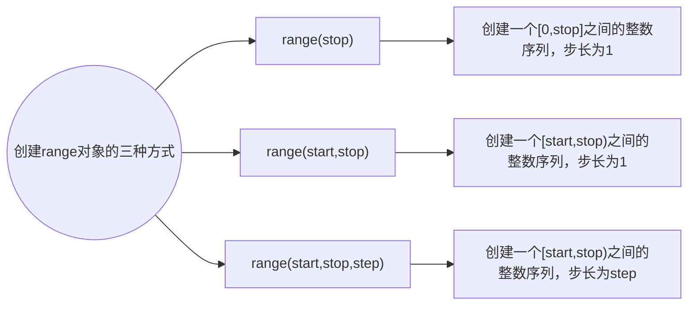

## 13-循环语句

<hr/>

### 一：range( ) 函数



   1. range( stop )

      + **演示：**

        ```python
        nums = range(10)
        for i in nums:
            print(nums[i])
        ```

        **输出：**

        ```python
        0
        1
        2
        3
        4
        5
        6
        7
        8
        9
        ```

   2. range( start, stop )

      + **演示：**

        ```python
        nums1 = range(2,10)
        for i in nums1:
            print(i)
        ```

        **输出：**

        ```python
        2
        3
        4
        5
        6
        7
        8
        9
        ```

   3. range( start, stop, step )

      + **演示：**

        ```python
        nums2 = range(2,12,2)
        for i in nums2:
            print(i)
        ```

        **输出：**

        ```python
        2
        4
        6
        8
        10
        ```

        

### 二：循环结构

1. 反复做同一件事情的情况，称为循环。

2.  循环的分类

   1. while
   2. for -in

   

### 三：while循环

+ <font color="orange">while 条件表达式:</font>

  ​	<font color="orange">循环体</font>

+ **演示：**

  ```python
  a = 1
  while a < 10:
      print(a)
      a+=1
  ```

  **输出：**

  ```python
  1
  2
  3
  4
  5
  6
  7
  8
  9
  ```

+ **案例：**

  ```python
  # 计算0~4之间的累加和
  sum = i = 0
  while i<=4:
      sum+=i
      i+=1
  print("0~4之间的累加和是："+str(sum))
  
  # 计算1~100间的偶数和
  sum1 = 0
  i1 = 1
  while i1<=100:
      if i1%2==0:
          sum1+=i1
      i1+=1
  print("1~100间的偶数和："+str(sum1))
  ```

  **输出：**

  ```python
  0~4之间的累加和是：10
  1~100间的偶数和：2500
  ```

  

### 四：for-in 循环

+ in 表达从（字符串，序列等）中一次取值，又称为遍历

+ for-in 遍历的对象必须是可迭代对象

+ 如果用不到自定义变量，可以将它设置为“ _ ”

+ 语法结构

  <font color='orange'><font color='red'>for</font>  自定义变量  <font color='red'>in</font>  可迭代对象:</font>

  ​	<font color='orange'>循环体</font>

+ **演示：**

  ```python
  str1 = 'Python'
  for _ in str1:
      print(_)
  for i in range(10):
      print(i)
  ```

  **输出：**

  ```python
  P
  y
  t
  h
  o
  n
  0
  1
  2
  3
  4
  5
  6
  7
  8
  9
  ```

+ **案例：**

  ```python
  # 求出100~999之间的水仙花数( 即：个、十、百位的立方和的和相加 )
  for item in range(100,1000):
      sum = 0
      for i in str(item):
          sum += int(i)**3
      if sum==item:
          print(sum)
  ```

  **输出：**

  ```python
  153
  370
  371
  407
  ```

  

### 五：拓展

1. break 与 continue

   - `break` 用于终止整个循环，退出循环体。
   - `continue` 用于跳过当前迭代，继续下一次迭代。
   - 这两个语句通常用于在循环内根据特定条件控制循环的执行流程。

   + **案例：**

     ```python
     # 输入密码，正确结束，否则一直提示输入密码
     password = "0215song"
     while True:
         pw = input('请输入密码：')
         if pw == password:
             print("密码正确")
             break
         else:
             print("密码错误")
             continue
     ```

     **输出：**

     ```python
     请输入密码：5485484
     密码错误
     请输入密码：848548
     密码错误
     请输入密码：0215song
     密码正确
     ```

2. while - else

   **案例：**

   ```python
   c = 0
   while  c<3:
       if(input("请输入密码：") == "song"):
           print("密码正确")
           break
       else:
           print("密码错误")
       c+=1
   else:
       print("三次没有输入正确，永久锁定！")
   ```

   **输出：**

   ```python
   请输入密码：4444
   密码错误
   请输入密码：444
   密码错误
   请输入密码：444
   密码错误
   三次没有输入正确，永久锁定！
   ```

3. for - else

   **案例：**

   ```python
   for i in range(3):
       if (input("请输入密码：") == "song"):
           print("密码正确")
           break
       else:
           print("密码错误")
   else:
       print("三次没有输入正确，永久锁定！")
   ```

   **输出：**

   ```python
   请输入密码：s
   密码错误
   请输入密码：song
   密码正确
   ```

4. 综合案例

   ```python
   '''九九乘法表'''
   for i in range(10):
       for j in range(i):
           print(str(j+1)+'*'+str(i)+"="+str(i*(j+1)),end="\t")
       print('\n')
       
   '''输出一个三行四列的矩形'''
   for i in range(3):
       for j in range(4):
           print('*',end='\t')
       print()
   
   '''输出一个直角三角形'''
   for i in range(1,11):
       for j in range(i):
           print('*',end='')
       print()
   ```

   **输出：**

   ```python
   1*1=1	
   1*2=2	2*2=4	
   1*3=3	2*3=6	3*3=9	
   1*4=4	2*4=8	3*4=12	4*4=16	
   1*5=5	2*5=10	3*5=15	4*5=20	5*5=25	
   1*6=6	2*6=12	3*6=18	4*6=24	5*6=30	6*6=36	
   1*7=7	2*7=14	3*7=21	4*7=28	5*7=35	6*7=42	7*7=49	
   1*8=8	2*8=16	3*8=24	4*8=32	5*8=40	6*8=48	7*8=56	8*8=64	
   1*9=9	2*9=18	3*9=27	4*9=36	5*9=45	6*9=54	7*9=63	8*9=72	9*9=81	
   
   *	*	*	*	
   *	*	*	*	
   *	*	*	*	
   
   *
   **
   ***
   ****
   *****
   ******
   *******
   ********
   *********
   **********
   ```

   
