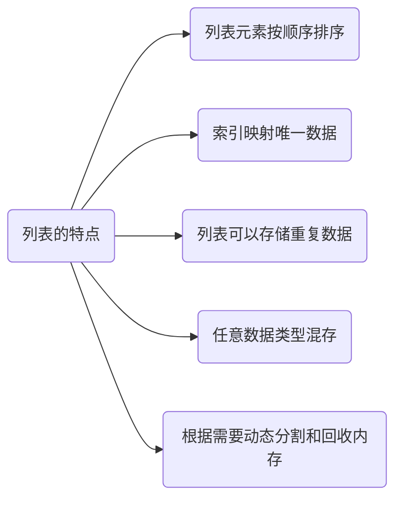

## 14-列表

<hr/>

### 一：列表是什么

+ 列表是Python编程语言中的一种数据结构，它是一种有序的、可变的数据类型，用于存储多个元素的集合。
+ 列表可以包含任何类型的元素，例如整数、浮点数、字符串、布尔值等，甚至可以包含其他列表（嵌套列表）。

+ 列表示意图

  | **索引** | -5      | -4     | -3   | -2   | -1   |
  | :------- | ------- | ------ | ---- | ---- | ---- |
  | 数据     | ’hello' | 'word' | 12   | 12.5 | True |
  | 索引     | 0       | 1      | 2    | 3    | 4    |

  

### 二：创建列表

+ 列表创建需要是用中括号 [] ，元素之间使用英文的逗号进行分割

+ 创建方式

  1. 是用中括号
  2. 使用内置函数 list
  3. 列表生成式

+ ```python
  list1 = ['nb','ko']    # 1
  list2 = list(['op','ys'])    # 2
  lsit3 = [i for i in range(1,11)]	#3
  ```


### 三：列表的特点




### 四：获取指定元素的索引

+ `index()` 方法用于在列表（或其他序列类型，如字符串和元组）中查找指定元素的索引位置。

+ 如果存在相同的元素，只返回第一个的下标

+ 如果查询的内容在列表中不存在，或报错。（ <font color='red'>ValueError</font> ）

+ 也可以在指定的范围中查找内容。

+ **演示：**

  ```python
  lst3 = ['hello','word','hello','windows']
  print(lst3.index('windows'))
  ### 在限定范围内查找相应的值
  print(lst3.index('hello',1,4))
  ```

  **输出：**

  ```python
  3
  2
  ```


### 五：获取列表中的单个元素

+ 在列表中，正向索引是从 *0 — (N-1)* ，逆向索引是从 *-N — -1*。
+ 如果索引不存在，就会报错。（ <font color='red'>IndexError</font> ）


### 六：获取列表的多个元素（切片操作）

+ 语法格式：

  <font color='orange'>列表名[ start : stop : step ]</font>

+ 拷贝源列表的某个片段，范围是：[ start - stop )

+ `step`是正数时，`start`默认是第一个元素，`stop`默认是最后一个元素；

  `step`是负数时，`start`默认是最后一个元素，`stop`默认是第一个元素。

+ **演示：**

  ```python
  lst5 = [1,2,3,4,5,6,7,8,9]
  lst6 = lst5[1:7:1]
  print(lst6)
  lst7 = lst5[-1:-6:-1]
  print(lst7)
  lst8 = lst5[1:8:2]
  print(lst8)
  ```

  **输出：**

  ```python
  [2, 3, 4, 5, 6, 7]
  [9, 8, 7, 6, 5]
  [2, 4, 6, 8]
  ```


### 七：列表元素的增删改

1. 增
   + > append( <font color=gray>value</font> )：在列表末尾添加一个元素

     > extend( <font color=gray>[ <font color=gray>value1</font> , <font color=gray>value2 </font> , <font color=gray>......</font> ]</font> )：在列表末尾添加任意个元素

     > insert( <font color=gray>位置 , value</font> )：在列表任意位置插入一个元素

     > 切片：在列表任意位置插入任意个元素。<font color=orange>list[ start : stop ] = listCopy</font>			

   + **演示：**

     ```python
     lst9 = [1,2,3,4]
     print(lst9,id(lst9))
     lst9.append(5)  # append()
     print(lst9,id(lst9))
     lst9.extend([6,7,8])    # extend()
     print(lst9)
     lst9.insert(4,'中')  # insert()
     print(lst9)
     lst9[3:-3]=['切片','操作']  # 切片
     print(lst9)
     ```

     **输出：**

     ```python
     [1, 2, 3, 4] 1928759790016
     [1, 2, 3, 4, 5] 1928759790016
     [1, 2, 3, 4, 5, 6, 7, 8]
     [1, 2, 3, 4, '中', 5, 6, 7, 8]
     [1, 2, 3, '切片', '操作', 6, 7, 8]
     ```

2. 删

   + > remove( value )：删除指定的值，若有重复的，只删除第一个

     > pop( index )：删除指定索引的值，若不指定索引，默认删除最后一个

     > del  列表片段：使用`del`语句可以删除指定索引位置的元素或整个列表

     > clear()：清除整个列表

   + **演示：**

     ```python
     lst10 = [2,3,4,3,5,6,7,8,9,10,11,12,13]
     lst10.remove(3) # remove()
     print(lst10)
     lst10.pop() # pop()
     print(lst10)
     lst10.pop(2)    # pop()
     print(lst10)
     del lst10[1:5]  # del语句
     print(lst10)
     lst10.clear()   # clear()
     print(lst10)
     ```

     **输出：**

     ```python
     [2, 4, 3, 5, 6, 7, 8, 9, 10, 11, 12, 13]
     [2, 4, 3, 5, 6, 7, 8, 9, 10, 11, 12]
     [2, 4, 5, 6, 7, 8, 9, 10, 11, 12]
     [2, 8, 9, 10, 11, 12]
     []
     ```

3. 改

  + > 1、通过索引改变

    > 2、通过切片改变

    > 3、通过循环依次改变

  + **演示：**

    ```python
    lst11 = [1,2,3,4]
    lst11[1] = 'nb'     # 通过索引改变
    print(lst11)
    lst11[1:3] = ['nb','ok',666]   # 通过切片改变
    print(lst11)
    for i in range(len(lst11)):     # 通过循环依次改变
        if isinstance(lst11[i],str):
            lst11[i] = lst11[i].upper()
    print(lst11)
    ```

    **输出：**

    ```python
    [1, 'nb', 3, 4]
    [1, 'nb', 'ok', 666, 4]
    [1, 'NB', 'OK', 666, 4]
    ```


### 八：列表排序

+ sort() 方法

  > `sort()`方法用于在原地对列表进行排序，即修改原始列表。默认情况下，它会按照升序排序。

+ sorted() 方法

  >  b'\xe6\xa1\x82\xe6\xa1\x82'桂桂python

+ **演示：**

  ```python
  lst12 = [2,4,7,1,8,3,7,3,8,2,5,3,7,3]
  lst12.sort()
  print(lst12)    # sort()方法，升序
  lst12.sort(reverse=True)
  print(lst12)    # sort()方法，降序
  lst13 = [3,7,8,9,1,4,8,3,9,2,6]
  lstcp1 = sorted(lst13)   # sorted()方法，升序
  print(lstcp1)
  lstcp2 = sorted(lst13,reverse=True)     # sorted()方法，降序
  print(lstcp2)
  ```

  **输出：**

  ```python
  [1, 2, 2, 3, 3, 3, 3, 4, 5, 7, 7, 7, 8, 8]
  [8, 8, 7, 7, 7, 5, 4, 3, 3, 3, 3, 2, 2, 1]
  [1, 2, 3, 3, 4, 6, 7, 8, 8, 9, 9]
  [9, 9, 8, 8, 7, 6, 4, 3, 3, 2, 1]
  ```


### 九：列表生成式

+ <font color='orange'>list01 = [  i<sup> (1)</sup>  for  i  in  range(1,11) ]</font>

  <sup>(1)</sup>：作为传入 list01 列表中的元素
  
  

### 拓展

1. 判断指定元素在列表中是否存在

   + 元素	<font color='orange'>in</font>	列表名

     元素	<font color='orange'>not in</font>	列表名

   + **演示：**

     ```python
     lst100 = [34,'kkl','sjl']
     print(34 in lst100)
     print(34 not in lst100)
     ```

     **输出：**

     ```python
     True
     False
     ```

2. 列表元素的遍历

   + <font color='orange'>for	迭代对象	in 列表名:</font>

     ​	<font color='orange'>## 操作</font>

   + **演示：**

     ```python
     lst101 = [23,12,54]
     for item in lst101:
         print(item)
     ```

     **输出：**

     ```python
     23
     12
     54
     ```


3. isinstance( )

   + `isinstance()` 是一个内置函数，用于检查一个对象是否是指定类或类型的实例。

   + bool isinstance( <font color=gray>object , type|[ type1, type2, ... ]</font> )

     + object：要检查的对象
     + type：可以是一个类( class )、类型( type )或一个包含类或类型的元组，用于检查对象是否属于这些类或类型之一。

   + **演示：**

     ```python
     iit1 = 12
     iit2 = 12.2
     iit3 = 'song'
     print(isinstance(iit1,(int,str)))
     print(isinstance(iit2,(int,str)))
     print(isinstance(iit3,str))
     ```

     **输出：**

     ```python
     True
     False
     True
     ```

     
